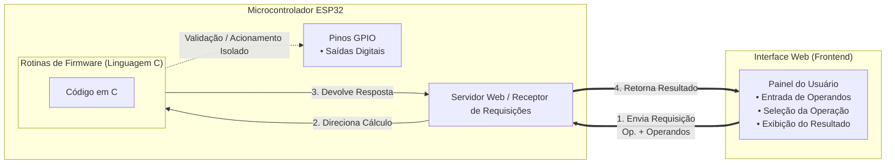

```mermaid
graph LR
    %% Definição das camadas e blocos por escopo

    %% Camada 1: Interface do Usuário
    subgraph Web ["Interface Web (Frontend)"]
        UI[Painel do Usuário<br>• Entrada de Operandos<br>• Seleção da Operação<br>• Exibição do Resultado]
    end

    %% Camada 2: Microcontrolador e Lógica
    subgraph ESP ["Microcontrolador ESP32"]
        Comm[Servidor Web / Receptor de Requisições]
        
        subgraph Firmware ["Rotinas de Firmware (Linguagem C)"]
            Soma[Código em C]
        end
        
        GPIO[Pinos GPIO<br>• Saídas Digitais]
    end


    %% Fluxo de Dados e Controle
    UI ===>|1. Envia Requisição<br>Op. + Operandos| Comm
    Comm --->|2. Direciona Cálculo| Firmware
    Firmware --->|3. Devolve Resposta| Comm
    Comm ===>|4. Retorna Resultado| UI
    
    Firmware -.->|Validação / Acionamento Isolado| GPIO
```